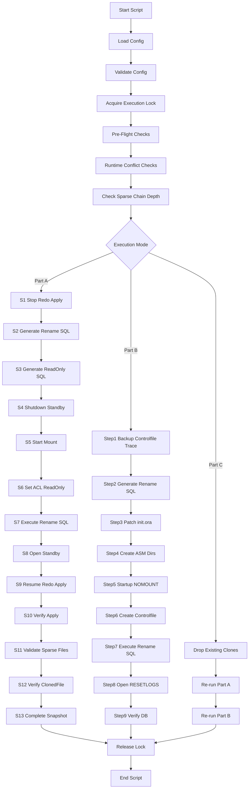
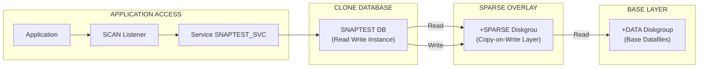

# Exadata Sparse Standby Automation

## Overview

Managing sparse standby environments manually is:
- error-prone
- operationally heavy
- unsafe at scale

This script provides Production-grade automation for **hierarchical sparse standby snapshots and clones** on Oracle Exadata in Data Guard environments with a **deterministic, auditable, and repeatable workflow** for:

- Creating sparse standby snapshots
- Building hierarchical sparse clones
- Refreshing environments safely
- Enforcing Oracle chain limits

---
## Requirements
- Oracle 19c or above GI/DB on Exadata
- Sparse Diskgroup (+SPARSE)
- Diskgroup should have enought space available 
- Data Guard Setup
- Access between `oracle` & `grid` via `sudo/ssh/direct`.

## Configuration Variables
Source via --config or edit script header. Defaults/examples:

<details>
<summary><b>Standby Database</b></summary>

| Variable | Default / Example | Description |
|----------|------------------|------------|
| STBY_DB_NAME | TESTCDB1 | DB name (same as primary) |
| STBY_DB_UNIQUE_NAME | TESTCDB2 | Unique standby DB name |
| STBY_ORACLE_SID | TESTCDB21 | First instance SID |
| STBY_INSTANCES | TESTCDB21 TESTCDB22 | RAC: space-separated list of ALL instance SIDs<br>Single-instance: only one SID |
| PRIMARY_DB_UNIQUE_NAME | TESTCDB1 | Primary DB unique name |

</details>

---

<details>
<summary><b>Cascaded Data Guard</b></summary>

| Variable | Default / Example | Description |
|----------|------------------|------------|
| CASCADED_STANDBY | false | Set true if standby receives redo from another standby |
| CASCADE_SOURCE_DB_UNIQUE_NAME | (empty) | Upstream standby DB unique name |

</details>

---

<details>
<summary><b>Test Master (Snapshot Source)</b></summary>

| Variable | Default / Example | Description |
|----------|------------------|------------|
| TM_DB_NAME | TESTCDB3 | Test Master DB name |
| TM_DB_UNIQUE_NAME | TESTCDB3 | Test MasterUnique name |
| TM_ORACLE_SID | TESTCDB31 | Test Master SID |
| TM_DATA_DG | +DATA | Parent diskgroup |

</details>

---

<details>
<summary><b>Snapshot Database</b></summary>

| Variable | Default / Example | Description |
|----------|------------------|------------|
| SNAP_DB_NAME | SNAPDEV | Snapshot DB name |
| SNAP_DB_UNIQUE_NAME | SNAPDEV | Snapshot DatabaseUnique name |
| SNAP_ORACLE_SID | SNAPDEV1 | Snapshot Database SID |
| SNAP_SPARSE_DG | +SPARSE | Sparse diskgroup |
| SNAP_DATA_DG | +DATA | Data diskgroup |

</details>

---

<details>
<summary><b>Oracle Environment</b></summary>

| Variable | Default / Example | Description |
|----------|------------------|------------|
| ORACLE_HOME | /u01/app/oracle/... | Oracle Home Path |
| ORACLE_BASE | /u01/app/oracle | Oracle Base |
| ORACLE_USER | oracle | OS user |

</details>

---

<details>
<summary><b>Grid / ASM</b></summary>

| Variable | Default / Example | Description |
|----------|------------------|------------|
| GRID_HOME | /u01/app/.../grid | Grid Home |
| GRID_USER | grid | Grid OS user |
| ASM_SID | +ASM1 | ASM SID |
| ASM_EXEC_METHOD | sudo | sudo / ssh / direct |
| ASM_SSH_KEY | ~/.ssh/id_rsa | SSH key |
| ASM_SSH_HOST | localhost | ASM host |

</details>

---

<details>
<summary><b>RAC / srvctl</b></summary>

| Variable | Default / Example | Description |
|----------|------------------|------------|
| NO_RAC | false | set `true` when it is single instance |
| SRVCTL_TIMEOUT | 600 | Timeout (seconds) |

</details>

---

<details>
<summary><b>Data Guard</b></summary>

| Variable | Default / Example | Description |
|----------|------------------|------------|
| DGMGRL_APPLY_WAIT_SECS | 120 | Wait for apply lag |
| DGMGRL_APPLY_LAG_THRESHOLD | 30 | Acceptable lag (seconds) |

</details>

---

<details>
<summary><b>Sparse Chain Control</b></summary>

| Variable | Default / Example | Description |
|----------|------------------|------------|
| SPARSE_CHAIN_WARN_DEPTH | 7 | Warning threshold |
| SPARSE_CHAIN_MAX_DEPTH | 8 | Abort threshold |

</details>

---

<details>
<summary><b>Directories & Logs</b></summary>

| Variable | Default / Example | Description |
|----------|------------------|------------|
| WORK_DIR | `${ORACLE_BASE}`/admin/`${STBY_DB_UNIQUE_NAME}`/sparse_standby} | Working directory |
| ADUMP_DIR | `${ORACLE_BASE}`/admin/`${SNAP_DB_NAME}`/adump} | Audit dump dir |
| LOGFILE | auto-generated | Main log |
| CHAIN_LOG | chain log | Persistent chain log |

</details>

---

<details>
<summary><b>Snapshot Creation</b></summary>

| Variable | Default / Example | Description |
|----------|------------------|------------|
| REDO_SIZE | 200M | Redo size |
| REDO_BLOCKSIZE | 512 | Block size |
| REDO_GROUPS | 3 | Number of redo groups |
| TEMP_SIZE | 10G | Temp tablespace size |
| IS_CDB | true | CDB flag to `false` when it non-cdb |
| FORCE_SHUTDOWN | false | Force shutdown |
| SNAP_CONTROL_FILE | `${SNAP_DATA_DG}`/`${SNAP_DB_NAME}`/control1.f} | Control file |
| SNAP_INDEX | 0 | Snapshot version index |

</details>

---

<details>
<summary><b>Refresh Settings</b></summary>

| Variable | Default / Example | Description |
|----------|------------------|------------|
| SOURCE_DB_NAME | PRIMARY_DB | Source DB |
| SNAP_SID_LIST | SNAPDEV1 | Snap DB list |
| REFRESH_METHOD | dataguard | `dataguard` will use the redp apply to catch up <br> `rman` will use incremental backups to catcup |

</details>

---

<details>
<summary><b>Execution Control</b></summary>

| Variable | Default / Example | Description |
|----------|------------------|------------|
| DRY_RUN | false | Simulate execution, set `true` when required |
| SAFE_EXEC_TIMEOUT | 300 | Command timeout |

</details>

---

<details>
<summary><b>ASM Space Thresholds</b></summary>

| Variable | Default / Example | Description |
|----------|------------------|------------|
| ASM_SPARSE_MIN_FREE_MB | 10240 | Sparse DG minimum free MB |
| ASM_DATA_MIN_FREE_MB | 5120 | Data DG minimum free MB |

</details>

---

<details>
<summary><b>Runtime Safety</b></summary>

| Variable | Default / Example | Description |
|----------|------------------|------------|
| ENABLE_RUNTIME_CHECKS | true | Enable runtime checks |
| FORCE_RUNTIME_OVERRIDE | false | Override safty checks |
| SESSION_THRESHOLD | 0 | Allowed active sessions |

</details>

--- 

## Architecture Overview

### Automation Workflow




---

### Flow Insights

- **Critical Path:** Pre-checks → Chain validation → Snapshot → Clone
- **Failure Points:**
  - Apply not stopped (S1)
  - ASM ACL failure (S6)
  - Rename SQL mismatch (S7)
  - Controlfile creation errors (Part B)
- **Safe Restart:** Script is idempotent at each step boundary
---

## Exadata Sparse Clone – Layered Architecture Diagram 



---

### Interpretation

#### Layered View

* **Base Layer (`+DATA`)**

  * Holds the golden copy of datafiles
  * Never modified by clones

* **Overlay Layer (`+SPARSE`)**

  * Stores only changed blocks
  * Implements copy-on-write

* **Database Layer (Clone)**

  * Independent database instance
  * Uses SPARSE as abstraction layer

* **Application Layer**

  * Connects via SCAN and service
  * Fully isolated from standby/base

---

## Key Features
| Feature | Description |
|---------|-------------|
| **Safe Execution** | `safeexec` w/ 300s timeouts, retries, flock locks, stale PID recovery |
| **Dry-Run** | `--dry-run`: Full simulation, no changes |
| **Modular** | Single steps (`--step S1`), phases (`--sparse-standby`, `--clone`) |
| **Configurable** | `--config file` overrides 50+ variables |
| **Logging** | Per-run (`LOGFILE`), persistent chain (`CHAINLOG`), colored output |
| **Verification** | Apply lag <30s, DB status, sparse files, V$ relations |
---

### Key Concepts

- **Sparse Files** → Copy-on-write datafiles in +SPARSE
- **Parent Files** → Read-only base in +DATA
- **Chain Depth** → Max 10 (script enforces safe threshold)
- **CLONEDB_RENAMEFILE** → Oracle internal sparse mapping

---

## Workflow Structure

### Part A — Sparse Standby Snapshot

Steps S1–S13:

1. Stop redo apply
2. Generate rename SQL
3. Set datafiles READ ONLY (ACL)
4. Shutdown standby
5. Create sparse files
6. Restart standby
7. Resume redo apply

### Part B — Sparse Clone Creation

- Controlfile trace generation
- File renaming logic
- INIT.ORA patching (Python-assisted)
- NOMOUNT → OPEN RESETLOGS

### Part C — Refresh Cycle

- Drop old clones
- Take new snapshot
- Rebuild fresh environments

---

## Execution Modes

| Mode | Description |
|------|------------|
| Full | Runs A → B → C |
| Snapshot Only | Only Part A |
| Clone Only | Only Part B |
| Refresh | Part C lifecycle |

---

## Usage Examples

### Full Run

```bash
./exadata_sparse_standby.sh
```

### With Config

```bash
./exadata_sparse_standby.sh --config prod.conf
```

### Simulate snapshot (Dry run)

```bash
./exadata_sparse_standby.sh --sparse-standby --dry-run  
```

### Refresh chain  
```bash
./exadata_sparse_standby.sh --refresh --force 
```

### Single Instance Mode

```bash
./exadata_sparse_standby.sh --no-rac
```

### Help
```bash
./exadata_sparse_standby.sh --help
```

---


## Outputs and Next Steps
- *Generated*: WORKDIR/{renamefiles.sql, setdatafilesreadonly.sql}, init.ora, controlfile scripts.
- *Logs*: LOGFILE (grep STEP/ERROR), CHAINLOG (persistent), audit.
- *Summaries*: Green completion banners with DBs, index, reminders (e.g., "Restart TM: sqlplus STARTUP", mask before distribute).
- After snapshot: --clone; periodic: --refresh.[1]

## Safety and Troubleshooting
- *Locks/Timeouts*: Concurrent blocked; stale recovered; SRVCTLTIMEOUT=600s.
- *Checks*: ENABLERUNTIMECHECKS=true; fails on ORA-/DGM-/space/chain.
- *Dry-Run/Skip*: Test safely; --skip-shutdown if TM down.
- *Errors*: Colored RED ERROR; machine-parseable markers.
- Grep CHAINLOG for events; review safeexecaudit.log for cmds.


## Logging

### Files

```
WORK_DIR/
 ├── sparse_standby_<timestamp>.log
 ├── safe_exec_audit.log
 └── sparse_standby_chain.log
```

### Log Types

- INFO / WARN / ERROR
- STEP / SUBSTEP
- Full command output capture

---

## Chain Depth Strategy

Oracle limit: **10**

Script defaults:

- Warn at: 7
- Abort at: 8

Why:
- Prevent deep dependency chains
- Avoid performance degradation
- Reduce corruption blast radius

---

## Failure Model

The script **fails fast** when:

- ORA-/RMAN-/DGM errors detected
- Invalid config
- insufficient ASM space
- unsafe runtime conditions

All failures are:
- logged
- audited
- deterministic

---

## Security Model

- No credentials stored
- OS authentication only
- Input sanitization on all variables
- No shell injection possible via config

---


## When NOT to Use This

- Non-Exadata environments
- No ASM sparse diskgroup
- No Active Data Guard

---

## Operational Best Practices

- Keep chain depth ≤ 7
- Schedule periodic refresh cycles
- Monitor ASM free space
- Use DRY_RUN before production execution
- Integrate logs with monitoring systems

---


## License

Copyright (c) 2026 Oracle GSC

All rights reserved.

This script is provided for morrisons, UK use within authorized environments only.  
Unauthorized distribution, modification, or commercial use is strictly prohibited without prior written permission.

## Usage Notice

This tool is intended for:

- Oracle Exadata environments  
- Experienced DBAs and platform engineers  
   - deep Oracle knowledge
   - understanding of Data Guard internals
   - familiarity with ASM and Exadata

Improper use may lead to:

- Data corruption  
- Data Guard inconsistencies  
- Production outages  

Always validate in non-production before use.


